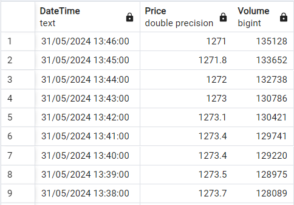

# Assignment_01
## Deploy ETL process crawl data vn30f1m, Schedule task with airflow and runing in Docker container 
- Use Selenium crawl price, volume data vn30f1m from website: https://banggia.vps.com.vn/chung-khoan/derivative-VN30
- Push it into AWS RDS
### format data

